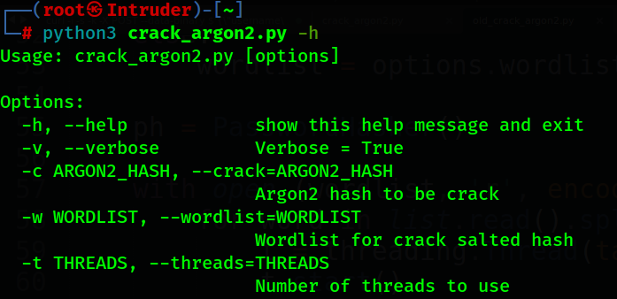
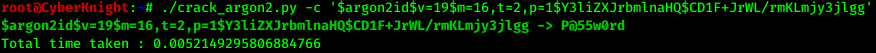

## Argon2 hash Cracker
### [_Click for **Web View..**_](https://CyberKnight00.github.io/Argon2_Cracker/)

It is a great tool for cracking or recovering Argon2 hashed password.
This tool support all variants of Argon2 hash.

### What is Argon2

Argon2 is a key derivation function that was selected as the winner of the Password Hashing Competition in July 2015. It is designed by Alex Biryukov, Daniel Dinu, and Dmitry Khovratovich from University of Luxembourg. Argon2 has 3 variants : Argon2d, Argon2i and Argon2id.

[ Know More ](https://en.wikipedia.org/wiki/Argon2)

##### Input parameters of Argon2
```
Argon2 has 3 variants : Argon2d, Argon2i and Argon2id. And 6 main input parameters.

password (P):       Password (or message) to be hashed
salt (S):           Salt (16 bytes recommended for password hashing)
parallelism (p):    Degree of parallelism (i.e. number of threads)
tagLength (T):      Desired number of returned bytes
memorySizeKB (m):   Amount of memory (in kibibytes) to use
iterations (t):     Number of iterations to perform

version (v):        The current version is 0x13 (19 decimal)
key (K):            Optional key (Errata: PDF says 0..32 bytes, RFC says 0..2^32 bytes)
associatedData (X): Optional arbitrary extra data
hashType (y):       Number (0=Argon2d, 1=Argon2i, 2=Argon2id)
```

### Download and Setup
```sh
> git clone https://github.com/CyberKnight00/Argon2_Cracker.git
> pip3 install -r requirement.txt
> chmod +x crack_argon2.py
```
### Usage

#### Invoke Help
```sh
> ./crack_argon2.py
```


```sh
> ./crack_argon2.py -h
```


#### Argon2 hash recovering

```sh
# In this command -c option is used to specify Argon2id type hash.
# Default word-list (/usr/share/wordlists/fasttrack.txt) is used if no wordlist is specified.
> ./crack_argon2.py -c '< Argon2 hash >'
```


```sh
# In this command -c option is used to specify Argon2id type hash & -v for Verbose output.
# Default wordlist is used
> ./crack_argon2.py -c '< Argon2 Hash >' -v
```


```sh
# To specify custom wordlist -w opting is to be supply.
> ./crack_argon2.py -c '< Argon2 Hash >' -w '< Path/To/Wordlist >'
```

